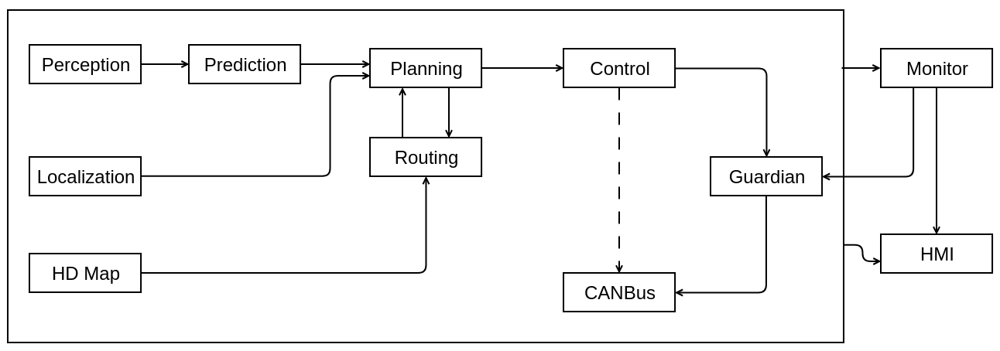

# plan路径规划 —— 注意输入输出
[Dig into Apollo - Planning](https://github.com/daohu527/Dig-into-Apollo/tree/master/modules/planning#planning_io)

整体输入输出流： 

可以看到规划(planning)模块的上游是Localization, Prediction, Routing模块，而下游是Control模块。Routing模块先规划出一条导航线路，然后Planning模块根据这条线路做局部优化，如果Planning模块发现短期规划的线路行不通（比如前面修路，或者错过了路口），会触发Routing模块重新规划线路，因此这两个模块的数据流是双向的。

## 概念
规划(planning)模块的作用是根据感知预测的结果，当前的车辆信息和路况规划出一条车辆能够行驶的轨迹，这个轨迹会交给控制(control)模块，控制模块通过油门，刹车和方向盘使得车辆按照规划的轨迹运行。 
规划模块的轨迹是短期轨迹，即车辆短期内行驶的轨迹，长期的轨迹是routing模块规划出的导航轨迹，即起点到目的地的轨迹，规划模块会先生成导航轨迹，然后根据导航轨迹和路况的情况，沿着短期轨迹行驶，直到目的地。这点也很好理解，我们开车之前先打开导航，然后根据导航行驶，如果前面有车就会减速或者变道，超车，避让行人等，这就是短期轨迹，结合上述的方式直到行驶到目的地。 
