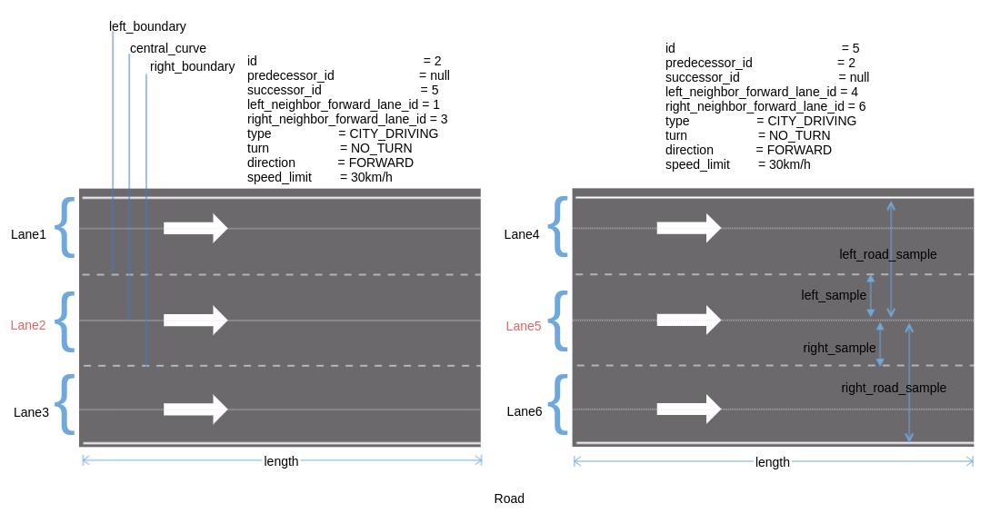
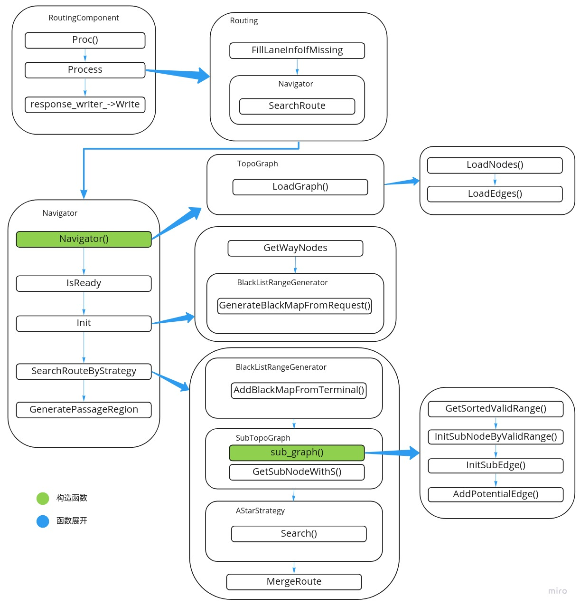

# 路线规划/全局路径规划

[Dig into Apollo - Routing](https://github.com/daohu527/Dig-into-Apollo/tree/master/modules/routing)

[demo](https://daohu527.github.io/)  
这个demo可以设置选择什么routing算法，然后根据from和to的位置进行routing规划。

Routing类似于现在开车时用到的导航模块，通常考虑的是起点到终点的最优路径（通常是最短路径），Routing考虑的是起点到终点的最短路径，而Planning则是行驶过程中，当前一小段时间如何行驶，需要考虑当前路况，是否有障碍物。Routing模块则不需要考虑这些信息，只需要做一个长期的规划路径即可。

分析Routing模块之前，我们只需要能够解决以下几个问题，就算是把routing模块掌握清楚了。

如何从A点到B点  
如何规避某些点 - 查找的时候发现是黑名单里的节点，则选择跳过。 
如何途径某些点 - 采用分段的形式，逐段导航（改进版的算法是不给定点的顺序，自动规划最优的线路）。 
如何设置固定线路，而且不会变？最后routing输出的结果是什么？固定成文件的形式。 

## 输入输出
输入：拓扑结构的图（因此，Apollo也先将base_map (高精度地图) 转换为routing_map (导航地图，有向图) ）。

输出：

过程： 
（1）建立拓扑图：apollo建图的实现在"routing/topo_creator"中 

首先是从base_map中读取道路信息，之后遍历道路，先创建节点，然后创建节点的边，之后把图(点和边的信息)保存到routing_map中，所以routing_map中就是graph_protobuf格式的固化，后面routing模块会读取创建好的routing_map通过astar算法来进行路径规划。

自动驾驶中的道路是车道线级别的，因此拓扑地图中的节点和边的定义也和之前的不完全一致：

apollo中的点：就是一条车道（具体的）； 
apollo中的边：车道和车道之间的连接（虚拟的，表示车道之间的关系） 

查看lane和road的区别： 
一条道路(road)，包含多个车道(lane)，图中一条道路分成了2段，每一段包含3条车道(lane)： 
车道lane的信息：车道唯一id，左边界，右边界，参考线，长度，前车道，后车道，左边相邻的车道，右边相邻的车道等  

最终构建的有向图/graph图： 
其中节点是一个个的lane，而边则代表lane之间的连接。 
NODE - 包括车道唯一id，长度，左边出口，右边出口（这里的出口对应车道虚线的部分，或者自己定义的一段允许变道的路段），路段代价（限速或者拐弯的路段会增加成本，代价系数在routing_config.pb.txt中定义)，中心线（虚拟的，用于生成参考线），是否可见，车道所属的道路id。 
EDGE - 则包括起始车道id，到达车道id，切换代价，方向（向前，向左，向右）。 

（2）astar算法来进行路径规划

